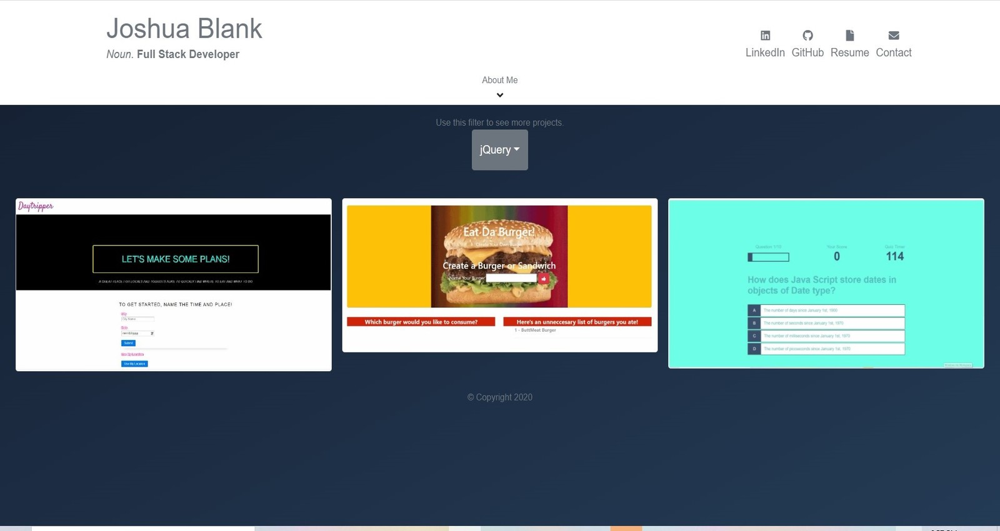

# Josh Blank's Portfolio in React
    
## Description: 

* This Portfolio showcases the majority of my completed projects, sortable by skill/language/technology, with links to the projects' github and deployed versions.   
    
## Table of Contents:  

* [License](#license)
* [Installation](#installation)
* [Tests](#tests)
* [Usage](#usage)
* [Technology Used](#technology-used)
* [Contributing](#contributing)
* [Questions](#questions)
* [Link](#link)
* [Image](#image)

    
## Installation: 

Use npm install.  
    
## Usage: 
    
This Portfolio can be used by employers to see why they absolutly must hire Josh Blank as their new Software Engineer. 

## Technology Used: 
    
Technologies used in this application: React, JavaScript, ReactStrap, React-animated-css.
    
## License: 
    
This project is licensed as: Joshua Blank Approved
    
## Contributing: 

There are no special requirements for using this repo.
    
## Tests: 

Be sure to run the following test(s): None
    
## Questions: 
    
If you have any questions, please reach out to [Joshua Blank](https://github.com/Jmnblnk54) @ jmnblnk@yahoo.com.

## Link: 
Github Repo:
https://github.com/Jmnblnk54/PortfolioInReact

Deployed:
https://jmnblnk54.github.io/PortfolioInReact

## Image:

